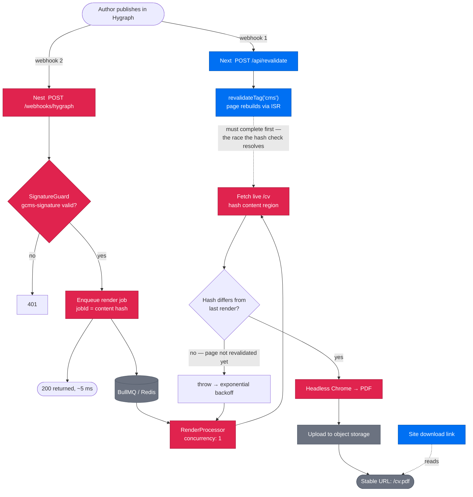

# NestJS PDF render service

> Sits after `replace-cms-cache.md`. That plan is a hard prerequisite — see **Sequencing**.
> Target repo: `engaging-render` (separate from `engaging`).

## Why this exists

`pnpm build` currently runs:

```
next build && npx puppeteer browsers install chrome@133 && node ./src/scripts/saveToPdf.ts && node ./src/scripts/saveStartupImages.ts
```

Three problems, all consequences of doing a browser render inside a frontend build:

1. **Every deploy pays for it.** A CSS tweak downloads a ~150 MB Chrome binary and performs a full headless render. Build time is dominated by work unrelated to the change.
2. **It is the most fragile step in the pipeline.** A slow browser download or a render timeout fails the deploy, so a frontend change can be blocked by a browser binary.
3. **The PDF can only change on deploy.** After `replace-cms-cache` lands, a CMS publish refreshes the page within seconds via `revalidateTag`. The downloadable PDF stays stale until the next push — the two fall out of sync.
4. **It pins the bundler.** `saveToPdf.ts` reads build output directly — `cv.html`, and CSS from `.next/static/css/`. Turbopack emits no `cv.html` and puts CSS in `.next/static/chunks/`, so the script breaks under it. A Node script's coupling to webpack's output layout is currently blocking a Next 16 / Turbopack upgrade. (The other half of that blocker — Turbopack dev silently dropping keyframes, breaking `fadeIn` — is a CSS-pipeline problem for Tailwind 4 to settle, and is unrelated to this service.)

Point 4 is the strongest public justification: a build step that is holding back unrelated tooling work is a cost being paid continuously, not a hypothetical.

The forced constraint that justifies a separate service: **a 10–20 second headless Chrome render does not fit Vercel's function execution limits**, and a 150 MB browser binary is not something to cold-start per invocation. This needs a long-lived container. That is the whole argument, and it is the one to lead with.

> Unverified: `package.json` references `./src/scripts/saveToPdf.ts` but the file appears to live at `src/utils/saveToPdf.ts`. Check before relying on either path.

## Explicitly out of scope — and why

Recorded because the reasoning was hard-won and the ideas will resurface.

| Rejected | Reason |
|---|---|
| Content BFF / gateway in front of Hygraph | A BFF intermediates **request-time** traffic. Pages are prerendered and revalidated by webhook, so visitors hit static HTML and never touch Hygraph. There is no runtime path to relieve — only a build-time hop to add. |
| Redis cache for CMS content | The workload is roughly two CMS fetches per deploy. `unstable_cache` + ISR already cover it. Caching a workload with no cache pressure invites the obvious question. |
| Replacing Hygraph as the build's data source | Would swap a CDN-backed SaaS for a free-tier container that cold-starts — a fragile dependency in front of a robust one. |
| `@nestjs/graphql` | Would be re-exposing GraphQL over GraphQL. REST out, GraphQL in, is the correct shape. |
| Microservice transports | One service, no bus. |

The governing principle: **this service must only ever remove things from the critical path, never add to it.** Moving Puppeteer out makes the Next build faster *and* more robust. If a proposed feature would make the site depend on this container, it does not belong here.

## Architecture



Two webhooks rather than a chain, deliberately: Nest never sits in the content-publish path, so if the render service is down the site still refreshes normally. The cost is a race, addressed below.

## The flow in prose

1. You publish in Hygraph.
2. Hygraph fires **two independent webhooks** — one to Next (revalidate, already built in `replace-cms-cache` Step 5), one to Nest.
3. Nest verifies `gcms-signature`, enqueues a job, and returns 200 in a few milliseconds. It does **not** render on the request.
4. A worker picks the job up, fetches the live `/cv`, and hashes the content.
5. If the hash matches the last successful render, Next has not finished revalidating — the job throws and BullMQ retries with backoff.
6. Once the hash differs: launch headless Chrome, render, print to PDF.
7. Upload to object storage at a stable URL. The site's download link points there and never waits on any of this.

**Why the queue** — not throughput. A render takes 10–20 s; holding the webhook request open that long would make Hygraph time out and retry, producing concurrent renders on one small container. The queue also gives durability (a job survives the process dying mid-render), automatic backoff, and `concurrency: 1` so two Chrome instances never compete for memory. State this honestly: it renders roughly twice a month, and the justification is resilience, not scale.

## The stale-render problem

Both webhooks fire simultaneously, so the worker can load `/cv` before ISR has served fresh content — producing a PDF of the *previous* CV. Worse than no PDF, because it is silently wrong.

Options considered:

1. **Fixed delay** (enqueue with 30 s delay) — cheap, works almost always, unprincipled.
2. **Chain through Next** (Hygraph → Nest → revalidate → on 200, enqueue) — ordered, but puts Nest in the publish path, violating the governing principle above.
3. **Content-hash check with bounded retry** — worker hashes the live page, retries with backoff until it changes, capped at ~5 attempts.

**Decision: option 3.** Self-correcting rather than tuned, keeps Nest out of the publish path, and is the piece most worth discussing in an interview. Roughly 30 lines more than the delay version.

Open detail: which part of the page to hash. Hashing the whole HTML picks up nonce/build-id noise; scope it to the rendered CV content region.

## Modules

```
AppModule
├── ConfigModule       — global, Zod-validated env; fails at boot, not first request
├── RenderModule       — webhook controller, SignatureGuard, BullMQ queue + processor
├── StorageModule      — object-storage client (upload, stable URL)
└── HealthModule       — @nestjs/terminus, for platform readiness checks
```

Four files of real logic: a controller, a guard, a processor, a storage service.

| Package | Doing real work? |
|---|---|
| `@nestjs/bullmq` + `@Processor` | **Yes** — the queue is the service |
| `@nestjs/config` + Zod | **Yes** — Hygraph, storage and webhook secrets |
| Custom `SignatureGuard` | **Yes** — real `gcms-signature` verification, not a shared secret |
| `@nestjs/terminus` | **Yes** — near-zero cost, platform needs it |
| `@nestjs/schedule` | **Marginal** — weekly re-render as a backstop against a missed webhook. Include only if actually relied on |
| `@nestjs/swagger` | **Marginal** — two endpoints. Cheap and visible; do not pretend it is load-bearing |

## Infrastructure

- **Container** — Fly.io or Railway. Chromium baked into the Docker image, so no per-build download.
- **Redis** — Upstash free tier, or Fly Redis. Required by BullMQ.
- **Object storage** — Cloudflare R2 (generous free tier) or S3.
- **API and worker in one container** to start; split later only if there is a reason.

Order of $0–5/month.

## Sequencing

`replace-cms-cache` must land first. It is not optional preparation — three of its steps are load-bearing here:

- **Step 5's revalidate route is required regardless.** `revalidateTag` only executes inside the Next runtime; Nest cannot invalidate Next's cache remotely, only POST that route. A separate service makes this route *more* necessary.
- **Step 2's snapshot matters more** once there is another thing that can be unavailable.
- **Step 3's typed fetch client** is what makes any later retargeting a URL and a header rather than a migration.
- **Step 1** is a pure bundle-size win, orthogonal to all of it.

Then, in order:

1. Scaffold the service; `/health` green on the platform.
2. `RenderModule` end to end, triggered manually — no webhook yet.
3. Storage upload + stable URL; point the site's download link at it.
4. Wire the Hygraph webhook and the signature guard.
5. Add the hash check and retry.
6. Only then remove the Puppeteer steps from `pnpm build`.

Step 6 last, so the build-time render stays as a fallback until the service is proven.

**Do not invest further in `saveToPdf.ts` layout polish before the move.** The logic transfers largely intact, but iterating on print layout is far cheaper once it is behind a queue that can be re-triggered without a deploy.

## Open questions

- **Contact endpoint — in or out?** It would be net-new scope, not a migration. Its honest justification is that it gives the service real request-time traffic, which legitimises `ValidationPipe`, DTOs and `@nestjs/throttler`. That is "build a feature so the demo has something to demonstrate" — the weaker kind of argument. Secondary benefit: stops publishing an email and street address in plain text. **Defer until the render service works**; decide then whether the repo feels too thin.
- **Storage provider** — R2 vs S3. R2 for egress cost and free tier unless there is a reason.
- **What replaces the PDF during the transition** — keep the committed build-time PDF until step 6.

## Talking points

Answers worth having ready, since the repo's purpose is partly to be discussed:

- *"Why not a serverless function?"* — Execution limits vs a 10–20 s render, plus a 150 MB binary to cold-start. The hard constraint. Lead with this.
- *"Why a queue for something that runs twice a month?"* — Durability and retries, not throughput. Say it plainly; dressing it up as a scale story will not survive contact.
- *"What if the webhook fires twice?"* — `jobId` derived from the content hash, so duplicates collapse.
- *"What if the service is down?"* — The site is unaffected; the PDF goes stale until it recovers. Deliberate.
- *"What did it buy you?"* — Measure build time before and after. A real before/after number beats the architecture description.

Volunteering the limits of the design reads as judgement and pre-empts the question already forming.
